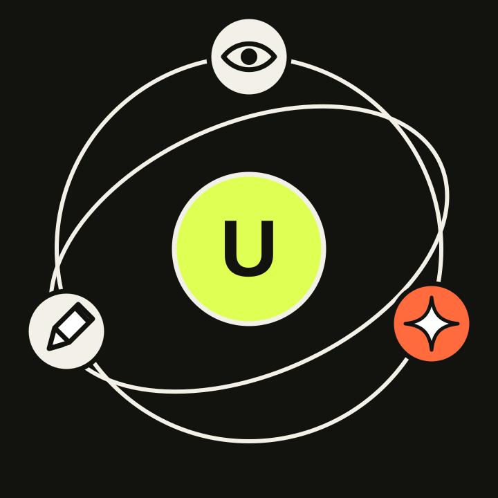

<p align="center">
  
</p>

<h1 align="center">UniSpace</h1>

Official repository for **UniSpace: Unified Visual Representation and Scalable
Multimodal Modeling**.

[Paper](https://arxiv.org/abs/2608.08676) ·
[HF Paper](https://huggingface.co/papers/2608.08676) ·
[Project page](https://yjb6.github.io/UniSpace/) ·
[Models](https://huggingface.co/yjb6/UniSpace)

> **Release status.** This branch is the paper-time landing release. The
> inference/evaluation source and checkpoints referenced below are being
> packaged for the first code release. UniSpace training code and internal data
> pipelines are intentionally not part of that release. Until the files listed
> in [Expected repository layout](#expected-repository-layout) are published,
> the commands below document the verified recipe but are not yet executable
> from a fresh clone.

## What UniSpace contains

UniSpace has two separately evaluated components:

1. **Patch-reparameterized vision encoders** (`PR-SigLIP2`, `PR-DINOv2`, and
   `PR-Qwen-ViT`) preserve the semantic representation of a pretrained vision
   encoder while adding the image detail required for reconstruction and
   generation.
2. **UniSpace** uses the Qwen-based patch-reparameterized tokenizer with a
   Qwen3-8B Mixture-of-Transformers model for image understanding, generation,
   and instruction-based editing.

The first code release is inference and evaluation only. It does not include
the UniSpace training pipeline.

## Results

### Patch-reparameterized vision encoders

ImageNet-1K validation reconstruction at 256 × 256, 50,000 images:

| Encoder | PSNR ↑ | SSIM ↑ | rFID ↓ |
|---|---:|---:|---:|
| PR-SigLIP2 | 29.64 | 0.87 | 0.18 |
| PR-DINOv2 | 30.84 | 0.90 | 0.14 |
| PR-Qwen-ViT | 30.16 | 0.88 | 0.17 |

ImageNet-1K class-conditional generation at 256 × 256, 50,000 images. `CFG`
uses scale 1.2; the non-CFG setting uses scale 1.0.

| Encoder | CFG | gFID ↓ | sFID ↓ | IS ↑ | Precision ↑ | Recall ↑ |
|---|---:|---:|---:|---:|---:|---:|
| PR-SigLIP2 | No | 4.409 | 6.675 | 190.66 | 0.722 | 0.646 |
| PR-SigLIP2 | Yes | 2.799 | 6.055 | 248.05 | 0.777 | 0.611 |
| PR-DINOv2 | No | 2.100 | 5.377 | 216.97 | 0.779 | 0.637 |
| PR-DINOv2 | Yes | 1.877 | 4.888 | 274.16 | 0.822 | 0.605 |

The reconstruction reruns from the selected release checkpoints are:

| Encoder | PSNR ↑ | SSIM ↑ | rFID ↓ | Images |
|---|---:|---:|---:|---:|
| PR-SigLIP2 | 29.6373 | 0.871131 | 0.175277 | 50,000 |
| PR-DINOv2 | 30.8397 | 0.898892 | 0.143589 | 50,000 |
| PR-Qwen-ViT | 30.1582 | 0.883640 | 0.169690 | 50,000 |

### UniSpace generation

| Benchmark | Breakdown | Scores | Overall ↑ |
|---|---|---|---:|
| GenEval | Single / Two / Count / Color / Position / Attribute | 0.98 / 0.92 / 0.69 / 0.88 / 0.83 / 0.73 | 0.84 |
| DPG-Bench | Global / Entity / Attribute / Relation / Other | 84.80 / 92.26 / 90.00 / 94.97 / 88.80 | 86.49 |
| OneIG EN | Align / Text / Reason / Style / Diversity | 0.860 / 0.937 / 0.311 / 0.467 / 0.233 | 0.561 |
| OneIG ZH | Align / Text / Reason / Style / Diversity | 0.807 / 0.881 / 0.276 / 0.455 / 0.244 | 0.533 |

### UniSpace editing

| Benchmark | Breakdown | Scores | Overall ↑ |
|---|---|---|---:|
| ImgEdit | Add / Adjust / Extract / Replace / Remove / Background / Style / Hybrid / Action | 4.53 / 4.38 / 3.61 / 4.67 / 4.42 / 4.23 / 4.55 / 2.70 / 4.47 | 4.28 |
| GEdit EN | Semantic consistency / Perceptual quality | 8.287 / 7.055 | 7.407 |
| GEdit ZH | Semantic consistency / Perceptual quality | 8.270 / 6.998 | 7.382 |

The clean rerun produced all 737 ImgEdit outputs and scored 4.25 overall. The
paper value is 4.28; all category differences are within 0.30. Judge-based
metrics can vary with the judge endpoint and model version.

## Expected repository layout

After the first code release, a fresh clone should contain the following
inference/evaluation subset:

```text
UniSpace/
├── environment.yml
├── requirements.txt
├── patch-reparameterization/
│   ├── configs/release/
│   ├── src/stage1/
│   ├── src/stage2/
│   ├── src/eval/
│   ├── run_eval_only.sh
│   └── run_sample_dit.sh
└── unispace/
    ├── modeling/
    ├── eval/
    └── scripts/eval/
```

The release will not contain `unispace/train/`, private dataset catalogs,
cluster submission files, or internal experiment management code.

## Installation

The verified environment is named `rae` and is shared by all components:

```bash
git clone https://github.com/yjb6/UniSpace.git
cd UniSpace
conda env create -f environment.yml
conda activate rae
```

Reference versions include Python 3.10, PyTorch 2.8.0, torchvision 0.23.0,
Transformers 4.57.3, Accelerate 1.12.0, and TensorFlow 2.20.0. TensorFlow is
used only by the canonical ADM ImageNet evaluator.

## Download checkpoints

The selected UniSpace model is the final SFT checkpoint at step `0012000` from
the experiment ending in `...from_stage3_0060000`. The public artifact uses the
short release name below; no earlier checkpoint is required for inference.

Download the release snapshot from Hugging Face:

```bash
huggingface-cli download yjb6/UniSpace \
  --local-dir checkpoints/UniSpace
```

The expected artifact layout is:

```text
checkpoints/UniSpace/
├── encoders/
│   ├── pr-siglip2-tokenizer.pt
│   ├── pr-dinov2-tokenizer.pt
│   ├── pr-qwen-vit-tokenizer.pt
│   ├── pr-siglip2-dit.pt
│   └── pr-dinov2-dit.pt
├── stats/
│   ├── pr-siglip2-normalization-stats.pt
│   ├── pr-dinov2-normalization-stats.pt
│   └── pr-qwen-vit-normalization-stats.pt
└── unispace-sft-0012000/
    └── model.safetensors
```

Checkpoint hashes are published as `SHA256SUMS` in the Hugging Face repository.
The released PR-SigLIP2 checkpoint uses the unified inference form for both
reconstruction and ImageNet generation.

## Reproduce encoder reconstruction

Prepare ImageNet-1K with the standard `train/` and `val/` class-directory
layout, then export paths without editing repository files:

```bash
export REPO_ROOT="$PWD"
export MODEL_ROOT=/path/to/pretrained-models
export PR_CHECKPOINT_ROOT="$PWD/checkpoints/UniSpace/encoders"
export PR_STATS_ROOT="$PWD/checkpoints/UniSpace/stats"
export IMAGENET_ROOT=/path/to/ImageNet1K
export IMAGENET_VAL_NPZ=/path/to/imagenet-val-reference.npz
export CONDA_ENV=rae
export NUM_GPUS=8
```

Run from `patch-reparameterization/`:

```bash
cd patch-reparameterization

bash run_eval_only.sh configs/release/pr-siglip2-imagenet256.yaml \
  "$PR_CHECKPOINT_ROOT/pr-siglip2-tokenizer.pt" \
  --output-dir ../outputs/pr-siglip2-recon \
  --num-samples 50000 --batch-size 32 --no-zeroshot

bash run_eval_only.sh configs/release/pr-dinov2-imagenet256.yaml \
  "$PR_CHECKPOINT_ROOT/pr-dinov2-tokenizer.pt" \
  --output-dir ../outputs/pr-dinov2-recon \
  --num-samples 50000 --batch-size 64 --no-zeroshot

bash run_eval_only.sh configs/release/pr-qwen-vit-imagenet256.yaml \
  "$PR_CHECKPOINT_ROOT/pr-qwen-vit-tokenizer.pt" \
  --output-dir ../outputs/pr-qwen-vit-recon \
  --num-samples 50000 --batch-size 16 --no-zeroshot
```

Each command evaluates EMA weights and writes a JSON containing PSNR, SSIM,
rFID, and sample count. Do not enable decoder noise for reconstruction. For
PR-DINOv2, retain the release normalization statistics and their default `z`
feature path; overriding it with `merged_tokens` changes the result.

## Reproduce ImageNet generation

The canonical generation metrics are ADM gFID, sFID, Inception Score,
precision, and recall. Set `FID_STATS_ROOT` to a directory containing the ADM
`evaluator.py`, frozen Inception graph, evaluation environment script, and
`VIRTUAL_imagenet256_labeled.npz`.

```bash
export FID_STATS_ROOT=/path/to/adm-evaluator
export ADM_FID_ENV=rae

# PR-SigLIP2, without CFG and with CFG 1.2
bash run_sample_dit.sh configs/release/pr-siglip2-imagenet256-generation.yaml \
  ../outputs/pr-siglip2-gen --cfg-scale 1.0 \
  --precomputed-latents-dir none --num-fid-samples 50000
bash run_sample_dit.sh configs/release/pr-siglip2-imagenet256-generation.yaml \
  ../outputs/pr-siglip2-gen-cfg --cfg-scale 1.2 \
  --precomputed-latents-dir none --num-fid-samples 50000

# PR-DINOv2, without CFG and with CFG 1.2
bash run_sample_dit.sh configs/release/pr-dinov2-imagenet256-generation.yaml \
  ../outputs/pr-dinov2-gen --cfg-scale 1.0 \
  --precomputed-latents-dir none --num-fid-samples 50000
bash run_sample_dit.sh configs/release/pr-dinov2-imagenet256-generation.yaml \
  ../outputs/pr-dinov2-gen-cfg --cfg-scale 1.2 \
  --precomputed-latents-dir none --num-fid-samples 50000
```

Sampling uses 50 Euler steps, seed 0, and equal class allocation. Reconstruction
and generation use separate configs so reconstruction preprocessing cannot
accidentally alter DiT sampling.

## Run UniSpace inference

UniSpace additionally requires the public Qwen3-8B base model. Set the three
model locations and validate them before allocating a GPU:

```bash
export REPO_ROOT="$PWD"
export MODEL_ROOT=/path/to/base-models
export UNISPACE_CHECKPOINT="$PWD/checkpoints/UniSpace/unispace-sft-0012000"

cp unispace/eval/gen/eval_sft_0012000.example.json eval.local.json
cd unispace
python -m eval.run_generation_config \
  --config ../eval.local.json --check-only
```

Run a single-prompt smoke test:

```bash
python -m eval.run_generation_config \
  --config ../eval.local.json \
  --prompt "A watercolor painting of a lighthouse during a winter sunrise."
```

The paper inference settings are 1024-pixel resolution, CFG 10, 50 steps,
timestep shift 0.112, maximum latent size 96, spatial merging enabled, and
unified-to-LLM sharing disabled.

## Reproduce UniSpace benchmarks

Generate benchmarks independently so a failure does not discard completed
outputs:

```bash
export UNISPACE_MODEL_PATH="$UNISPACE_CHECKPOINT"
export UNISPACE_LLM_PATH="$MODEL_ROOT/Qwen/Qwen3-8B"
export UNISPACE_VAE_CONFIG="$REPO_ROOT/patch-reparameterization/configs/vae/qwen3-temp-run-mar1024_eval.yaml"
export UNISPACE_EVAL_OUTPUT="$REPO_ROOT/outputs/unispace-eval"
export NPROC_PER_NODE=8

# Select any comma-separated subset.
export UNISPACE_BENCHMARKS=geneval,dpg,imgedit,gedit,oneig_en,oneig_zh
export IMGEDIT_BENCH_ROOT=/path/to/ImgEdit
export GEDIT_BENCH_ROOT=/path/to/GEdit-Bench
export ONEIG_BENCH_ROOT=/path/to/OneIG-Benchmark

bash scripts/eval/run_release_generation.sh
```

Expected output coverage is:

| Benchmark | Expected outputs |
|---|---:|
| GenEval | 2,212 |
| DPG-Bench | 1,065 |
| ImgEdit | 737 |
| GEdit | 1,212 |
| OneIG EN | 1,120 |
| OneIG ZH | 1,320 |

Use the official benchmark scorers after generation:

```bash
# DPG-Bench
bash eval/gen/dpg/dpg_bench/dist_eval.sh \
  "$UNISPACE_EVAL_OUTPUT/dpg/images" \
  "$UNISPACE_EVAL_OUTPUT/dpg/result_dpgbench_score.txt" 1024

# GEdit (requires a compatible judge endpoint)
export WISE_API_KEY=...
export WISE_API_BASE=...
export GEDIT_DATASET_PATH=stepfun-ai/GEdit-Bench
bash eval/gen/gedit/score.sh \
  "$UNISPACE_EVAL_OUTPUT/gedit/images" \
  "$UNISPACE_EVAL_OUTPUT/gedit/scores"

# OneIG; clone its official repository as ./OneIG-Benchmark first
bash eval/gen/oneig/score.sh \
  "$UNISPACE_EVAL_OUTPUT/oneig_en/images" \
  "$UNISPACE_EVAL_OUTPUT/oneig_en/scores" EN unispace
bash eval/gen/oneig/score.sh \
  "$UNISPACE_EVAL_OUTPUT/oneig_zh/images" \
  "$UNISPACE_EVAL_OUTPUT/oneig_zh/scores" ZH unispace
```

GenEval and ImgEdit scoring instructions will be linked to the exact upstream
versions in the stable release. API-judged results must record the judge model
and endpoint version.

## Reproduction checklist

Before comparing scores, verify all of the following:

- the checkpoint is `unispace-sft-0012000`;
- encoder evaluation uses EMA weights and exactly 50,000 ImageNet validation
  images;
- generation uses 50,000 samples, 50 Euler steps, seed 0, and CFG 1.0 or 1.2
  as shown above;
- UniSpace uses CFG 10, 50 steps, timestep shift 0.112, and the complete prompt
  set for each benchmark;
- output coverage matches the table before scoring;
- judge-based metrics record the judge version and do not silently discard
  refusals or unparsable responses.

## License and citation

The repository shell is released under the [MIT License](LICENSE). Model and
third-party component licenses will be listed with the corresponding release
artifacts.

```bibtex
@article{yan2026unispace,
  title   = {UniSpace: Unified Visual Representation and Scalable Multimodal Modeling},
  author  = {Yan, Jinbo and Qiao, Limeng and Qin, Jie and He, Jun-Yan and Wu, Feize and Wan, Guanglu},
  journal = {arXiv preprint arXiv:2608.08676},
  year    = {2026}
}
```
